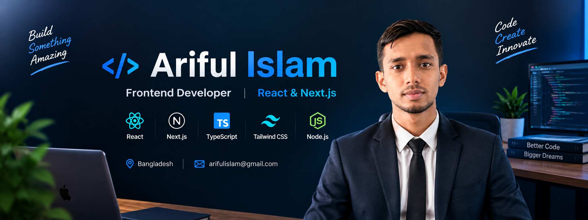

<p align="center">
  
</p>

# 👋 Hi, I'm Ariful Islam

### 🚀 Frontend Developer | React & Next.js


---

## 👨‍💻 About Me

I'm a passionate Frontend Developer from Bangladesh who enjoys building modern, responsive, and user-friendly web applications.

I started my journey with JavaScript and gradually moved into TypeScript, React, and Next.js. Currently, I'm focusing on building real-world projects and improving my frontend and full-stack development skills.

* 🔭 I'm currently exploring **Next.js**
* 🌱 I'm learning **Authentication & Full-Stack Development**
* 💻 I'm building projects with **React, Next.js & TypeScript**
* 🧩 I'm practicing **API integration, data fetching and state management**
* 🚀 I'm working on improving my **problem-solving skills**
* 📚 I enjoy learning new technologies by building projects
* 🎯 My goal is to become a **Full-Stack Developer**

---

## 🛠️ Skills & Technologies

### Frontend

<p align="left">
  
</p>

### Backend & Database

<p align="left">
  
</p>

### Tools & Others

<p align="left">
  
</p>

---

## 🚀 Current Focus

* ⚛️ Building projects with **React**
* ▲ Developing applications with **Next.js**
* 🔷 Writing scalable code with **TypeScript**
* 🔐 Learning **Authentication**
* 🌐 Working with **REST APIs**
* 📦 Learning better **state management**
* ☁️ Learning deployment with **Vercel**
* 🧑‍💻 Exploring **Full-Stack Development**

---

## 🌐 Connect With Me

<p align="left">
  <a href="https://github.com/arifulislam7979">
    
  </a>

  <a href="https://www.linkedin.com/in/YOUR-LINKEDIN-USERNAME">
    
  </a>

  <a href="mailto:YOUR-EMAIL@example.com">
    
  </a>
</p>

---

## 📊 GitHub Stats

<p align="center">
  
</p>

<p align="center">
  
</p>

<p align="center">
  
</p>

---

## 📈 Contribution Graph

[](https://github.com/arifulislam7979)

---

## 🚀 Featured Projects

### 🏋️ FitLog

A modern workout tracking application built with Next.js.

**Main Technologies:**

* Next.js
* React
* TypeScript
* Tailwind CSS
* REST API

**Features:**

* Workout library
* Workout details
* Add workouts to today's plan
* Save workouts
* Search workouts
* Workout statistics
* Responsive UI

🔗 **Live Demo:** [Add Live Link]

🔗 **Repository:** [FitLog Repository Link]

---

### 📚 Book Management App

A modern book management application built with Next.js.

**Main Technologies:**

* Next.js
* React
* TypeScript
* Tailwind CSS
* API / JSON data

**Features:**

* Browse books
* Book details
* Search and sorting
* Read books list
* Wishlist
* Responsive design

🔗 **Live Demo:** [Add Live Link]

🔗 **Repository:** [Book Project Repository Link]

---

## 🧠 Learning Journey

```text
JavaScript
    ↓
TypeScript
    ↓
React
    ↓
React Router
    ↓
API & Data Fetching
    ↓
Next.js
    ↓
Authentication
    ↓
Full-Stack Development
```

---

## 🎯 2026 Goals

* [x] Learn JavaScript
* [x] Learn TypeScript
* [x] Learn React
* [x] Learn Next.js Basics
* [x] Build More Real-World Projects
* [x] Learn Authentication
* [ ] Learn Backend Development
* [ ] Learn Databases
* [ ] Build Full-Stack Applications
* [ ] Become a Full-Stack Developer

---

## ⚡ Fun Fact

> I learn best by building projects, breaking things, fixing them, and building them again. 🚀

---

<p align="center">
  <b>Thanks for visiting my profile! 🙌</b>
</p>

<p align="center">
  <i>Always Learning • Always Building • Always Improving</i>
</p>
